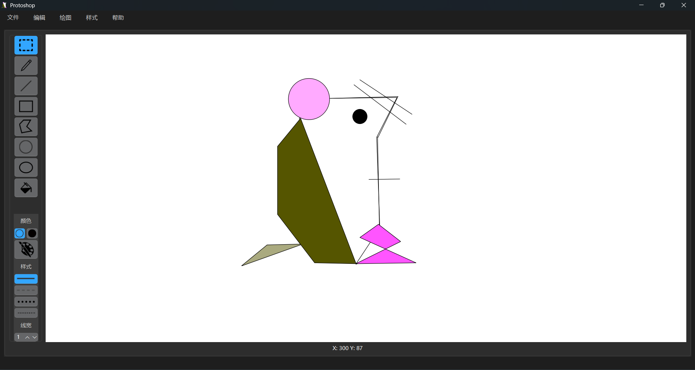

# Protoshop - 简易绘图程序

这是一个小巧的简易绘图程序，作为我的第一次计算机图形学大作业。这个名字是怎么由来的呢？首先 Photoshop 是著名的平面设计软件，拥有强大的绘图功能，而 proto- 前缀又有“原始的”的意思，所以这个名字意为“最原始的Photoshop”或者“经费不足版Photoshop”。Protoshop 还有数不清的不足与Bug，需要进一步改进和完善，欢迎提交 pr 帮助改进。目前只支持 Wimdows 系统。



## 主要功能

1. 部分基本图形绘制（任意画笔、线段、矩形、多边形、圆、椭圆）
2. 图形选择（仅矩形方框选择）
3. 图形变换：图形平移、图形缩放（尚不支持多边形）、图形旋转、多边形节点调整
4. 图形着色（包括边框着色与填充着色）
5. 从调色盘选择颜色
6. 边框类型选择：实线、虚线、点线、划-点交替线
7. 调整线框宽度（1~50px）
8. 鼠标坐标位置显示
9. 画布扩展：通过图形缩放可以将画布扩大
10. 文件保存：可以保存画布为 PNG 图片，也可以导出为 JSON 以便下次打开使用
11. 撤销与重做：可以撤销或重做在画布上的行为
12. 快捷键：详见“帮助→快捷键”
13. 窗口自适应

## 开发环境

Windows 10及以上, QtCreator, Qt 6.9, MinGW 64, C++ 11及以上, CMake 3.31（推荐）

## 如何使用

### 1. 直接下载.exe可执行文件

在右边的 Releases 下载打包好的可执行文件。

### 2. 下载源码，本地编译

下载源码

```bash
git clone https://github.com/fkjubitch/protoshop.git
```

在 QtCreator 中点击打开项目，选择 CMakeLists.txt 打开，为项目配置 Qt6 套件即可。

## 示例文件

在 "jsonexample" 文件夹中，有一个 json 文件示例，可以导入 Protoshop.

## 目前发现的问题

1. 有小概率情况会崩溃
2. 旋转后进行移动会闪现或漂移
3. 第一笔的开始点位于左上角
4. 图层混乱
5. 撤销与重做的Bug
